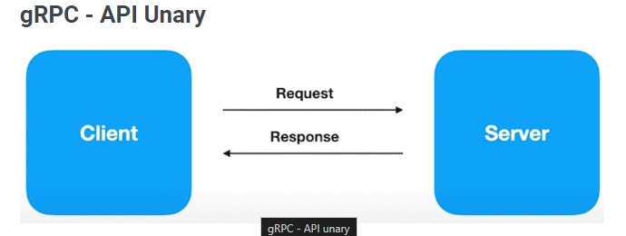

# gRPC

## O que é GRPC?

RPC → Remote Procedure Call

gRPC é um framework desenvolvido pela google que tem o objetivo de facilitar o processo de comunicação entre sistemas de uma forma extremamente rápida, leve e independente de linguagem.

---

## Em quais casos utilizar?

- Ideal para microserviços.
- Mobile, Browsers e Backend
- Geração das bibliotecas de forma automática (Geração automatica de codigo pra que voce tenha tudo configurado pra que voce implemente as regras da aplicação)
- Streaming bidirecional utilizando HTTP2 (Mantem o canal de comunicação aberto pra enviar diversas requests ou receber diversas responses em apenas uma conexão)

---

## Remote Procedure Call

- Existe um client e um server.
- Existe uma função no servidor, por exemplo:

```jsx
#servidor
func soma (int a, int b) {}
```

- Existe uma chamada no servidor invocando um procedimento(procedure) para que o server consiga responder a essa requisição.

```jsx
#client
server.soma(a,b)
```

---

## Protocol Buffers (Protobuf)

É uma linguagem criada de forma neutra, plataforma neutra, mecanismo de extensibilidade e serialização de dados - Pense como se fosse um XML mas menor, mais rapido e mais simples.

- Os dados sao trafegados no formato binario.
- Com os dados em binario, será muito mais rápido.
- Ao enviar os dados, você precisará montar os dados, transforma-los em binário e será enviado.
- Ao receber os dados, ele será descerializado (fazer o parsing desse objeto) para que ele consiga ser utilizado no nosso sistema.

---

## Protocol Buffers vs JSON

|  | Protocol buffer | JSON |
| --- | --- | --- |
| Arquivos |  binários ✅ | Texto ❌ |
| Processamento de serialização | Mais leve ✅ | Mais pesado ❌ |
| Recursos de rede | Menos ✅ | Mais ❌ |
| Velocidade de processo | Maior ✅ | Menor ❌ |

---

## Contrato Protocol Buffer

Assim como xml, protocol buffer’s também precisamn de contrato.

- Isso para que quem enviar e quem receber a informação saiba que exista um formato padrao.
- Esse padrao normalmente é chamado de protofile, ou seja, um arquivo de schema do protocol buffer(pyi).

Exemplo de um arquivo de protocol buffer:

```jsx
syntax = "proto3";

message SearchRequest {
	string query = 1;
	int32 page_number =2;
	int32 result_per_page = 3;
}
```

syntax → Indica a versão do protocol buffer (normalmente se usa a versão 3, principalmente pra utilização no gRPC)

### message SearchRequest {

message → O quie voce vai trafegar

SeachRequest → O nome da message

### string query = 1;

string → O tipo

query → Nome

= 1 → A ordem do dado

### O que significa o 1 ; 2 e 3?

Significa a ordem em que os dados são enviados, usado para controle interno do protocol buffer. (Há um limite)

---

# HTTP/2

- O nome original criado pela google era SPDY.
- Lançado em 2015
- Dados trafegados são binário e não textp como no HTTP 1.1
- Utiliza a mesma conexão [TCP](https://www.notion.so/Como-funciona-a-internet-389b0e41a5e44a56aeb2f7a5d36e3527?pvs=21) para enviar e receber dados do cliente e do servidor (Multiplex) → Abre a conexão, envia-se e recebe muitos dados e depois fecha-se a conexão.
- Server Push → Consigo mandar diversas informações do server para o client e vice-versa → Mando diversas informações para todos os clients que estão com conexão aberta.
- Headers são comprimidos
- Gasta menos recursos de rede
- Processo é mais veloz

---

## Formas de comunicação

[LINK ÚTIL](https://docs.leunardo.dev/grpc)

### gRPC - API “unary”

O cliente faz uma requisição(request) ao servidor e o servidor devolver uma resposta(response)



### gRPC - API “Server streaming”

O client faz uma requisição ao servidor e o servidor devolve uma resposta MAS essa response pode haver várias outras responses.


É util quando você faz uma solicitação a um servidor e o servidor tem que fazer muitos calculos mas você quer a resposta o mais rápido possível.

Nesse modo, enquanto os dados processados do lado do servidor vão ficando prontos, ele já envia para o cliente e o cliente processando no seu lado, fazendo com que o processo fique mais rápido.

### gRPC - API “Client streaming”

O client faz várias requisições ao servidor e quando o servidor terminar de receber tudo o que foi enviado pelo cliente e processar, ele envioacom uma única response.


Imagine que você tem que processar um arquivo com muitas linhas, ao invés de fazer a leitura completa desse arquivo, alocando tudo na memoria pra mandar tudo de uma vez, voce pode fazer com que envie dados ao servidor a cada ponto lido nesse arquivo e assim, o servidor ja pode começar a processar esses dados e quando o servicdor terminar de ler e processar tudo, ele manda uma unica resposta para o client.

### gRPC - API “Bi directional straming” (Cherry of pickl)

Tanto o client quanto o server vão mandando os dados continuamente,  o client vai mandando informações e conforme o server vai recebendo, ele também vai mandando essas informações tudo em formato de streaming.


---

## REST vs gRPC

| REST | gRPC |
| --- | --- |
| Texto/JSON | Protocol Buffers |
| Unidirecional | Bidirecional e Assíncrono |
| Alta latência | Baixa latência |
| Sem contrato (maior chance de erros) | Contrato definido (.proto) |
| Sem suporte a streaming (Request/ Response) | Suporte a streaming |
| Design pré definido | Desingn é livre |
| Bibliotecas de terceiros | Geração de código |

---

## Entendendo melhor sobre protocol buffes

[LINK ÚTIL](https://protobuf.dev/)

Aqui temos a definição de um protobuf como já mostrado anteriormente.

```protobuf
message Person {
  optional string name = 1;
  optional int32 id = 2;
  optional string email = 3;
}
```

Aqui ele cria uma pessoa, faz um build dessa pessoa e diz que isso é um FileOutputStream. (Em java).

Aqui ele vai pegar todas essas informações e gerar um binario

```java
Person john = Person.newBuilder()
    .setId(1234)
    .setName("John Doe")
    .setEmail("jdoe@example.com")
    .build();
output = new FileOutputStream(args[0]);
john.writeTo(output);
```

Aqui, faremos um parse from dos dados obtidos, vai ler esses daodos, serializar pra se obter os dados de volta. → Codigo em c++

```cpp
// C++ code
Person john;
fstream input(argv[1],
    ios::in | ios::binary);
john.ParseFromIstream(&input);
id = john.id();
name = john.name();
email = john.email();
```

---

## Instalando compiladores e plugins

[Link util](https://grpc.io/docs/languages/go/quickstart/)

Neste projeto, trabalharemos com a linguagem GO.

### Instalando protocol buffer Compiler

[https://grpc.io/docs/protoc-installation/](https://grpc.io/docs/protoc-installation/)

```bash
apt install -y protobuf-compiler
protoc --version  # Ensure compiler version is 3+
```

em caso de erro, rode o comando acima como root.

Obs.: Ao verificar se o protoc foi instalado com sucesso verificando sua versão, é importante também, verificar se a versão instalada foi a 3.

### Você precisará de duas bibliotecas instaladas no seu ambiente.

1 - protoc-gen-go → Utilizada para pegar o seu arquivo .proto do protocolbuffer e gerar as entidades, ou seja, vai pegar suas mensagens e fazer a geração de arquivos. (Certifique-se de ter o go instalado)

```bash
go install google.golang.org/protobuf/cmd/protoc-gen-go@v1.28
```

2 - protoc-gen-go-grpc → Utilizada para gerar as interfaces de comunicação usando gRPC.

```bash
go install google.golang.org/grpc/cmd/protoc-gen-go-grpc@v1.2
```

---

## Fazendo o setup do projeto

### Insira as informações

```bash
go mod init github.com/{your_user}/{repo}
#go mod init github.com/alanfranciscos/gRPC-GO
```

Crie uma pasta chamada internal e copie os arquivos encontrados na pasta internal deste **[repositorio](https://github.com/alanfranciscos/gRPC-GO)**.

### Baixe as dependências

```bash
go mod tidy
```

---

## Criação do Protofile

Crie uma pasta com o nome “proto” e dentro desa pasta, crie um arquivo chamado “course_category.proto”.

A sintaxe de um protofile é com aspas duplas e pronto e virgula( ; ).

Dentro do arquivo, a primeira linha deve ser

```protobuf
syntax = "proto3";
```

Como nos arquivos .go (category.go, course.go) definimos o package, aqui também definimos o package que por convenção, chamamos de pb originado de protocol buffer.

Na linha seguinte, insira:

```protobuf
package pb;
```

Temos também que dizer, aonde esse pacote vai ser instalado baseado na linguagem de programação que estamos utilizando.

Na linha seguinte, insira:

```protobuf
option go_package = "internal/pb";
```

Com o comando acima, irá gerar uma pasta pb dentro da pasta internal.

### Categorias

```protobuf
message Category {
    string id = 1;
    string name = 2;
    string description = 3;
}
```

Toda vez que vamos receber um resultado de uma categoria, podemos retornar varias categorias

```protobuf
message CategoryResponse {
    Category category = 1;
}
```

Quando vamos criar uma Category nova, nao sabemos qual o ID, por isso, deve-se criar mais uma message para que possamos criar sem precisar passar o id como parâmetro.

```protobuf
message CreateCategoryRequest {
    string name = 1;
    string description = 2;
}
```

Agora, vamos criar um serviço para que consigamos trabalhar com o rpc.

Aqui criamos um serviço chamado “rpc CreateCategory“ onde ele enviará uma CreateCategoryRequest e retornará uma CategoryResponse e no final da linha, comumente colocamos  “{}”.

```protobuf
service CategoryService {
    rpc CreateCategory(CreateCategoryRequest) returns (CategoryResponse) {}
}
```

---

## Fazendo a geração de código com PROTOC

Em caso de erro ao rodar os comandos abaixo, rode comandos separados e verifique aonde está o problema, pode ser que você encontre ao rodar —go_grpc_out=.

Consulte a [documentação](https://pkg.go.dev/google.golang.org/grpc/cmd/protoc-gen-go-grpc)

E também esse [link](https://stackoverflow.com/questions/60578892/protoc-gen-go-grpc-program-not-found-or-is-not-executable)

### pode ser que seja necessário instalar esse pacote:

```bash
go get -u google.golang.org/grpc
```

### Comando para gerar arquivos

```bash
protoc --go_out=. --go_grpc_out=. proto/course_category.proto

protoc --go_out=. --go-grpc_out=. proto/course_category.proto
```

Explicação →

- **`protoc`**: Este é o compilador oficial do Protocol Buffers, que é usado para gerar código a partir de arquivos **`.proto`**.
- **`-go_out=.`**: Esta opção especifica que o compilador deve gerar código em Go e o diretório de saída é o diretório atual (**`.`**). O código gerado incluirá as estruturas de mensagem e métodos associados. —Pra falar com Protocol Buffers—
- **`-go_grpc_out=.`**: Esta opção é específica para gRPC. Ela diz ao compilador para gerar o código de servidor e cliente gRPC em Go, também no diretório atual (**`.`**). —Pra falar com gRPC—
- **`proto/course_category.proto`**: Este é o arquivo de definição protobuf que contém as mensagens e serviços definidos em Protocol Buffers. Neste caso, você estará trabalhando com um arquivo chamado **`category.proto`** localizado no diretório **`proto`**.

### Arquivos

- O **`-go_out=.` gerará o arquivo → internal → pb → `course_category.pb.go`**
- O **`-go_grpc_out=.` gerará o arquivo → internal → pb → `course_category_grpc.pb.go`**

Agora, atualize os pacores:

```bash
go mod tidy
```

---

## Implementando CreateCategory - Service

Dentro da pasta internal, crie uma pasta service e em seguida um arquivo com o nome `category.go`.

```go
package service

// São auto imports! -> Certifique de ter a extensao do go no vscode
import (
	"context"

	database "github.com/alanfranciscos/gRPC-GO/internal/databases"
	"github.com/alanfranciscos/gRPC-GO/internal/pb"
)

type CategoryService struct {
	pb.UnimplementedCategoryServiceServer
	CategoryDb database.Category
}

func NewCategoryService(categoryDb database.Category) *CategoryService {
	return &CategoryService{
		CategoryDb: categoryDb,
	}
}

func (c *CategoryService) CreateCategory(ctx context.Context, in *pb.CreateCategoryRequest) (*pb.CategoryResponse, error) {
	category, err := c.CategoryDb.Create(in.Name, in.Description)

	if err != nil {
		return nil, err
	}

	categoryResponse := &pb.Category{
		Id:          category.Id,
		Name:        category.Name,
		Description: category.Description,
	}

	return &pb.CategoryResponse{
		Category: categoryResponse,
	}, nil
}
```

UnimplementedCategoryServiceServer → Gera compatibilidade com outras versões e também possibilita que você consiga adicionar outros metodos depois (Mesmo se voce quiser fazer outras chamadas).

---

## Criando serivdor gRPC

Para criar o nosso servidor gRPC, crie uma pasta chamada `cmd` e uma subpasta chamada `grpcServer` e dentro dessa pasta, crie um arquivo com o nome `main.go` com o seguinte conteúdo:

```go
package main

import (
	"database/sql"
	"net"

	database "github.com/alanfranciscos/gRPC-GO/internal/databases"
	"github.com/alanfranciscos/gRPC-GO/internal/pb"
	"github.com/alanfranciscos/gRPC-GO/internal/service"
	"google.golang.org/grpc"
	"google.golang.org/grpc/reflection"

	_ "github.com/mattn/go-sqlite3"
)

func main() {
	// Abre a conexão com db
	db, err := sql.Open("sqlite3", "./db.sqlite")
	if err != nil {
		panic(err)
	}
	defer db.Close()

	// cria o banco de dados
	categoryDb := database.NewCategory(db)
	// cria o serviço de categoria passando o banco de dados como parametro para que consiga fazer as operações no banco
	categoryService := service.NewCategoryService(*categoryDb)

	// cria o servidor grpc
	grpcServer := grpc.NewServer()
	// registra o serviço no servidor grpc
	pb.RegisterCategoryServiceServer(grpcServer, categoryService)
	// registra o servidor grpc para que consiga fazer a comunicação com o evans (cliente grpc)
	reflection.Register(grpcServer)

	// Abre a conexão tcp na porta 50051 para que consiga ter a comunicação com o grpc
	lis, err := net.Listen("tcp", ":50051")
	if err != nil {
		panic(err)
	}

	// inicia o servidor grpc
	if err := grpcServer.Serve(lis); err != nil {
		panic(err)
	}

}
```

`evans` → Client grpc

`reflection` → Quando consegue ler e processar sua propria informação

---

## Integindo com Evans (Client)

[https://github.com/ktr0731/evans](https://github.com/ktr0731/evans)

### O que é?

Um programa feito em GO que possibilita interagir de uma forma simples com o servidor gRPC.

### Instalação:

(Verificar qual a versão indicada do go pra esse tipo de instalação no repositorio)

```bash
go install github.com/ktr0731/evans@latest
```

Para iniciar o servidor, rode o seguinte comando no terminal:

```bash
go run cmd/grpcServer/main.go
```

Em uma nova aba do bash, insira o comando - Notifique-se de estar usando a porta 50051, caso contrario, é necessário especificar no bash:

```bash
evans -r repl
```

caso encontre erro ao rodar o comando acima, insira os dois comandos seguintes e depois ele novamente:

```bash
go clean -modcache
```

```bash
go install github.com/ktr0731/evans@latest
```

Com o evans rodando, insira esse comando:

(Verifique se ja esta em algum package)


```bash
show package
```


```bash
package pb
```


```bash
service CategoryService
```


Agora que estamos no service, faremos uma chamada ao gRPC.

```bash
call CreateCategory
```

Isso retornará um erro, já que não temos a tabela no banco de dados:


Para criarmos, abra mais uma aba no bash:

```bash
sqlite3 db.sqlite
```

```bash
create table categories (id string, name string, description string);
```

---

## Criando CategoryList no protofile

No arquivo .proto, crie a seguinte message:

```protobuf
message CategoryList {
    repeated Category categories = 1;
}
```

Ou seja, voce vai receber diversas (repeted) categorias.

Agora, criaremos um serviço chamado `ListCategories`, pra isso vamos alterar o service `CategoryService`.

- Note também que agora retornamos Category ao inves de CategoryResponse, isso porque eles retornavam a mesma coisa e estava redundante (a outra mensagem foi removida do codigo).

Nesse caso, não enviaremos nenhum parâmetro, porém, você não pode simplesmente nao enviar nada, por isso, é muito comum criarmos uma mensagem em branco(`blank`).

```protobuf
message blank{}

service CategoryService {
    rpc CreateCategory(CreateCategoryRequest) returns (Category) {}
		rpc ListCategories(blank) returns (CategoryList) {}
}
```

Agora gere novamente os arquivos com o comando:

```bash
protoc --go_out=. --go-grpc_out=. proto/course_category.proto
```

---

## Listando Categories

Para fazermos a implementação do list categories, precisamos resolver a interface que foi gerada no arquivo `internal/pb/course_category_grpc_pb.go`.

Entao, para isso, no arquivo `internal/service/category.go`, geraremos o codigo:

---

```go
package service

import (
	"context"

	database "github.com/alanfranciscos/gRPC-GO/internal/databases"
	"github.com/alanfranciscos/gRPC-GO/internal/pb"
)

type CategoryService struct {
	pb.UnimplementedCategoryServiceServer
	CategoryDb database.Category
}

func NewCategoryService(categoryDb database.Category) *CategoryService {
	return &CategoryService{
		CategoryDb: categoryDb,
	}
}

func (c *CategoryService) CreateCategory(ctx context.Context, in *pb.CreateCategoryRequest) (*pb.Category, error) {
	category, err := c.CategoryDb.Create(in.Name, in.Description)

	if err != nil {
		return nil, err
	}

	categoryResponse := &pb.Category{
		Id:          category.Id,
		Name:        category.Name,
		Description: category.Description,
	}

	return categoryResponse, nil
}

func (c * CategoryService) ListCategories(ctx context.Context, in *pb.Blank) (*pb.CategoryList, error) {
	categories, err := c.CategoryDb.FindAll()

	if err != nil {
		return nil, err
	}

	var categoryList []*pb.Category
	
	for _, category := range categories {
		categoryList = append(categoryList, &pb.Category{
			Id:          category.Id,
			Name:        category.Name,
			Description: category.Description,
		})
	}

	return &pb.CategoryList{
		Categories: categoryList,
	}, nil
}
```

---

## Buscando uma categoria

No arquivo .proto, adicione o seguinte codigo:

```protobuf
message CategoryGetRequest {
    string id = 1;
}

service CategoryService {
    rpc CreateCategory(CreateCategoryRequest) returns (Category) {}
    rpc ListCategories(blank) returns (CategoryList) {}
    rpc GetCategory(CategoryGetRequest) returns (Category) {}
}
```

Gere novamente os arquivos:

```protobuf
protoc --go_out=. --go-grpc_out=. proto/course_category.proto
```

Além disso, foram feitas mudanças no arquivo service e database para fazer o get Category by id. segue o arquivo `internal/service/category.go`

```protobuf
func (c *CategoryService) GetCategory(ctx context.Context, in *pb.CategoryGetRequest) (*pb.Category, error) {
	category, err := c.CategoryDb.Find(in.Id)

	if err != nil {
		return nil, err
	}

	categoryResponse := &pb.Category{
		Id:          category.Id,
		Name:        category.Name,
		Description: category.Description,
	}

	return categoryResponse, nil
}
```

---

## Trabalhando com Stream

Para fazermos isso, iremos criar mais um service no arquivo `.proto:`

```protobuf
service CategoryService {
    rpc CreateCategory(CreateCategoryRequest) returns (Category) {}
    rpc CreateCategoryStream(stream CreateCategoryRequest) returns (CategoryList) {}
    rpc ListCategories(blank) returns (CategoryList) {}
    rpc GetCategory(CategoryGetRequest) returns (Category) {}
}
```

```protobuf
rpc CreateCategoryStream(stream CreateCategoryRequest) returns (CategoryList) {}
```

Dessa forma, quem for enviar a solicitação, enviará em stream e quem retornará, retornará tudo de uma vez.

Gere novamente os arquivos:

```protobuf
protoc --go_out=. --go-grpc_out=. proto/course_category.proto
```

No arquivo `internal/service/category.go` insira o seguinte código:

```protobuf
func (c *CategoryService) CreateCategoryStream(stream pb.CategoryService_CreateCategoryStreamServer) error {
	categories := &pb.CategoryList{}

	for {
		category, err := stream.Recv()
		if err == io.EOF {
			return stream.SendAndClose(categories)
		}

		if err != nil {
			return err
		}

		categoryResult, err := c.CategoryDb.Create(category.Name, category.Description)
		if err != nil {
			return err
		}

		categories.Categories = append(categories.Categories, &pb.Category{
			Id:          categoryResult.Id,
			Name:        categoryResult.Name,
			Description: categoryResult.Description,
		})
	}
}
```

Note que ao rodar esse serviço, o evans pedirá uma categoria atrás da outra, dessa forma:


Para parar de inserir categorias, basta inserir o comando `Ctrl + D`.

E então, recebemos como resposta as categorias que criamos:


---

## Trabalhando com Streams bidirecionais

Para fazermos isso, iremos criar mais um service no arquivo `.proto:`

```protobuf
service CategoryService {
    rpc CreateCategory(CreateCategoryRequest) returns (Category) {}
    rpc CreateCategoryStream(stream CreateCategoryRequest) returns (CategoryList) {}
    rpc CreateCategoryStreamBidirectional(stream CreateCategoryRequest) returns (stream Category) {}
    rpc ListCategories(blank) returns (CategoryList) {}
    rpc GetCategory(CategoryGetRequest) returns (Category) {}
}
```

```protobuf
rpc CreateCategoryStreamBidirectional(stream CreateCategoryRequest) returns (stream Category) {}
```

Dessa forma, conforme formos criando, ja vamos recebendo a resposta.

Gere novamente os arquivos::

```protobuf
protoc --go_out=. --go-grpc_out=. proto/course_category.proto
```

No arquivo `internal/service/category.go` insira o seguinte código:

```protobuf
func (c *CategoryService) CreateCategoryStreamBidirectional(stream pb.CategoryService_CreateCategoryStreamBidirectionalServer) error {
	for {
		category, err := stream.Recv()
		if err == io.EOF {
			return nil
		}

		if err != nil {
			return err
		}

		categoryResult, err := c.CategoryDb.Create(category.Name, category.Description)
		if err != nil {
			return err
		}

		err = stream.Send(&pb.Category{
			Id:          categoryResult.Id,
			Name:        categoryResult.Name,
			Description: categoryResult.Description,
		})
		if err != nil {
			return err
		}
	}
}
```

Note que ao rodar esse serviço, o evans ao enviarmos uma categoria, ja recebemos a mesma processada.


Para parar de inserir categorias, basta inserir o comando `Ctrl + D`.